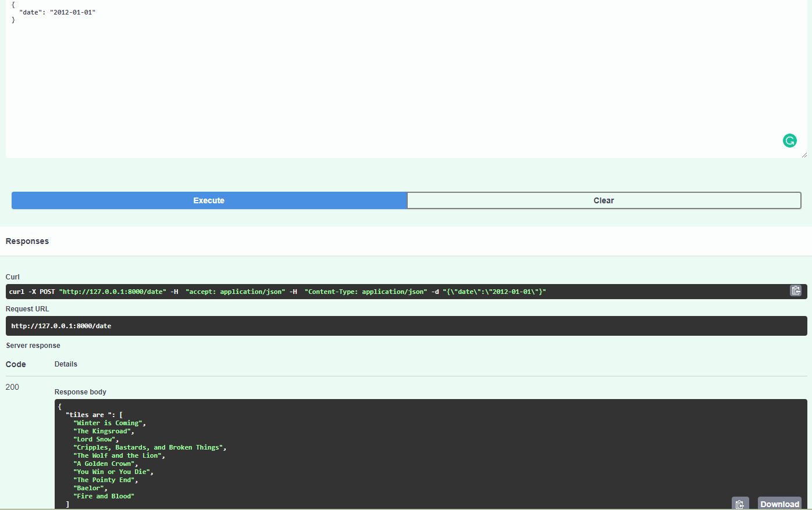

# Writing a simple HTTP API using FastAPI 

This repository allows you to get started with training a State-of-the-art Deep Learning model with little to no configuration needed!  You provide your labeled dataset and you can start the training right away and monitor it with TensorBoard. 
You can even test your model with our built-in Inference REST API. Training with TensorFlow has never been so easy.


- This repository is based on [FASTAPI](https://fastapi.tiangolo.com/tutorial/first-steps/)
- The python version used is 3.6


## Prerequisites 


- FASTAPI


#### How to check for prerequisites

**To check if you have fastapi installed:** 

`fastapi --version`


#### Installing Prerequisites

- If you don't have neither fastapi use the following  command 

`pip install fastapi[all]`


## Run the Solution

To run the solution, run the following command from the repository's root directory

```sh
uvicorn main:app --reload
```


After a successful run you should see something like the following:

## 


## Usage

- If the app is deployed on your machine:  open your web browser and type the following: `localhost:8000/docs` or `127.0.0.1:8000/docs`


------
#### 1- Show the Number of episodes


This function shows the number of episodes depending on the season or multiple seasons specified by the user.


------

#### 2- Show the titles of episodes


This function shows the title depending on the season and episode specified by the user.


------

#### 3- Show the titles of episodes depending on time


This function shows the title of all episodes before the time set by the user the specified format is "yyyy-mm-dd".





------
#### 4- Show the handling of errors


This function shows how each error is treated in a different way depending on the parameter that is missing, incomplete or not valid.


------

------


------

## Thank you

I would like to thank you for taking time in reading this small HTTP API creation example.

Elio ELHoyeck


